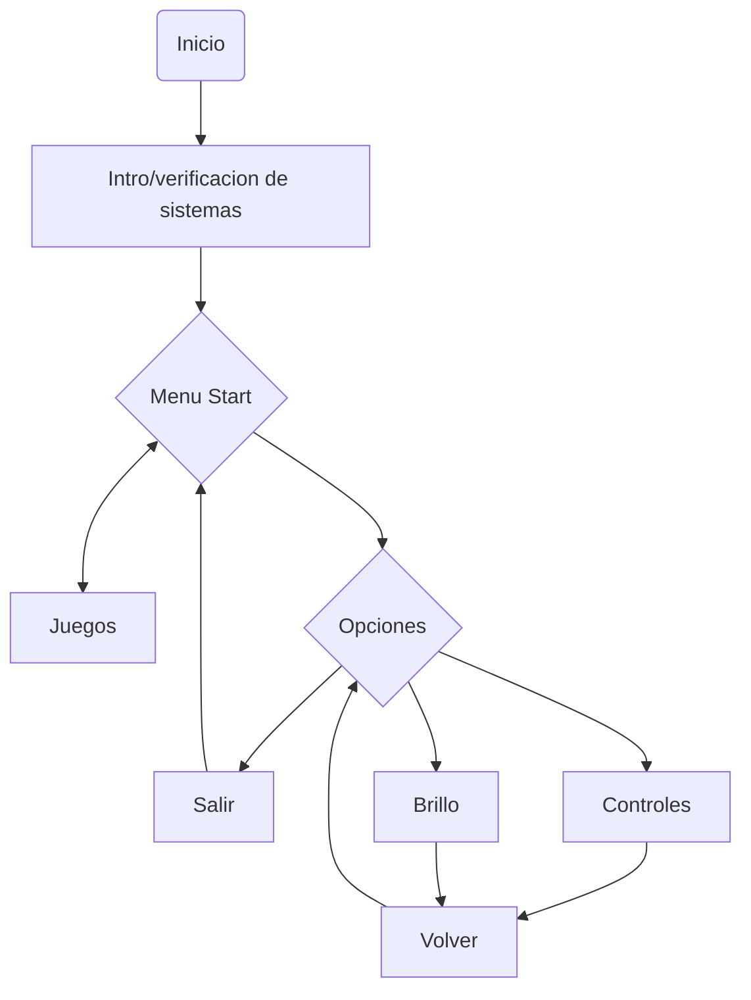
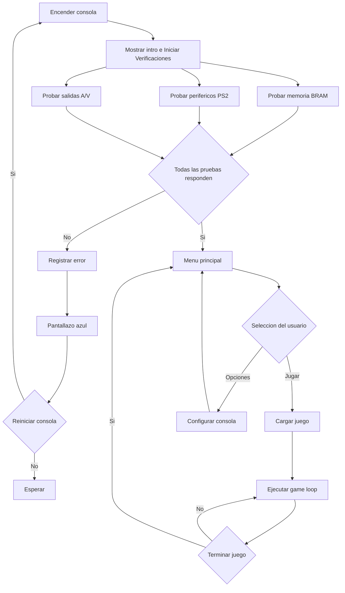
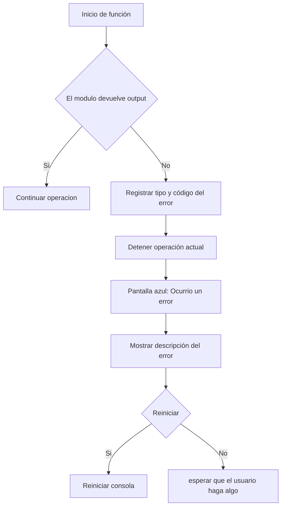
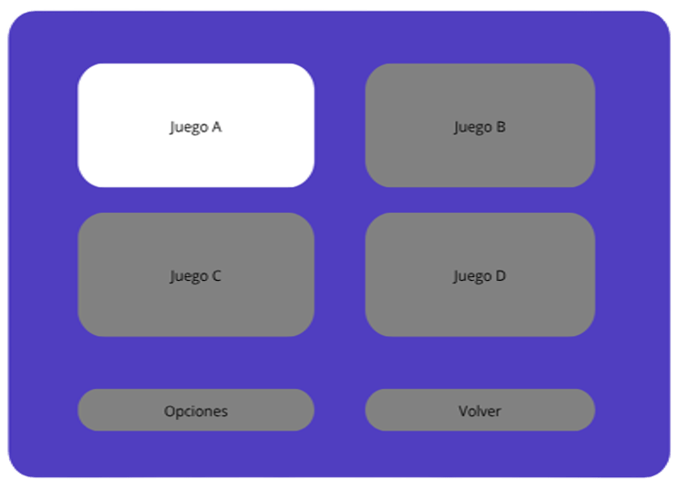
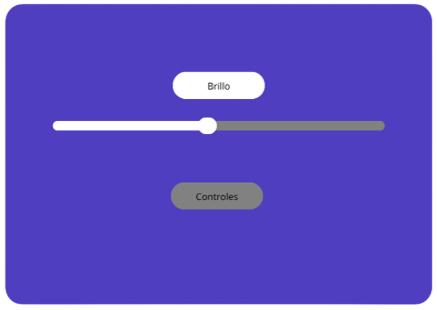
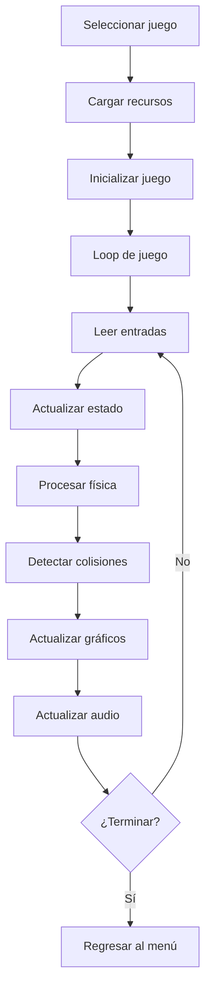

# Proyecto Consola Digital - Arquitectura y Flujo

Este repositorio contiene la arquitectura de hardware para el desarrollo de una consola interactiva, basada en la integración de módulos periféricos y de procesamiento.

## Diagrama de Flujo Principal

El sistema se divide en tres estados principales: Verificación, Menu principal y Juego.

## Diagrama de flujo de la consola

Este flujo representa la secuencia completa del sistema desde el encendido. Las
pruebas del POST pueden ejecutarse en paralelo, pero el sistema central espera
la respuesta de todos los módulos antes de habilitar el menú.

## Verificaciones de los sistemas al encender

Al encender el sistema, se ejecuta un diagnóstico de hardware mientras se carga la secuencia una intro tipo ps3.

[Ejemplo](https://www.youtube.com/watch?v=Ywh-aIfEcew)

La idea es que mientras se este ejecutando esta intro, se ejecuten test de todos los modulos:

- Diagnóstico de Memoria: Verificación rápida de lectura/escritura en BRAM 

- Test de Periféricos: Detección de entradas conectadas mediante los controladores PS/2

- Test de salidas de video/audio.

cada test lo hace el grupo correspondiente y en el software al iniciarse simplemente se llaman.

### Manejo de errores

Cada función debe tener manejo de errores. El sistema central espera un output
de cada módulo; si no lo recibe, considera que el módulo falló, detiene la
operación actual y muestra una pantalla de error.

## Menu Principal y Configuracion

### Menu
Interfaz de usuario en estado de espera para seleccionar juegos o ajustar parámetros de la consola.

    

### Configuracion

    

Interfaz Gráfica: Renderizado de menú estático a cargo del display driver (Grupo J).

Navegación: El controlador PS/2 (Grupo E) decodifica las pulsaciones del usuario para mover el cursor y seleccionar opciones.

Ajustes: Modificación de parámetros físicos (ej. brillo, volumen) transmitidos a la placa mediante I2C (Grupo H).

## Juego (Game Loop)

- Carga de datos: Cargar los recursos necesarios desde la memoria.
- Logica principal: Procesar el estado del juego, físicas y colisiones.
- Entrada: Leer las acciones del jugador.
- Video: Actualizar los elementos graficos.
- Audio: Reproducir los sonidos del juego.

## Referencias

- https://docs.espressif.com/projects/esp-idf/en/v4.4/esp32/api-guides/error-handling.html
- https://learn.microsoft.com/en-us/windows-hardware/drivers/whea/components-of-the-windows-hardware-error-architecture