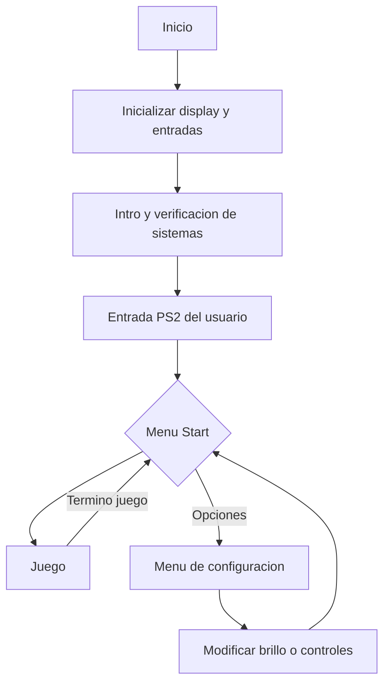
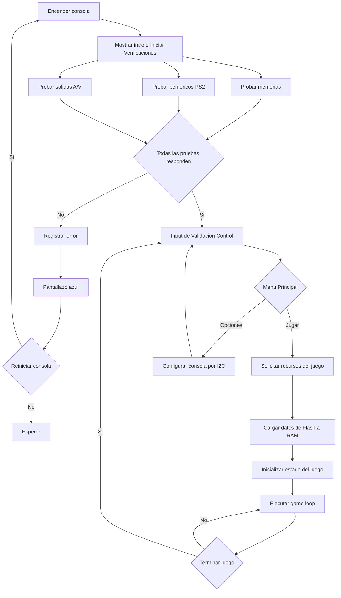
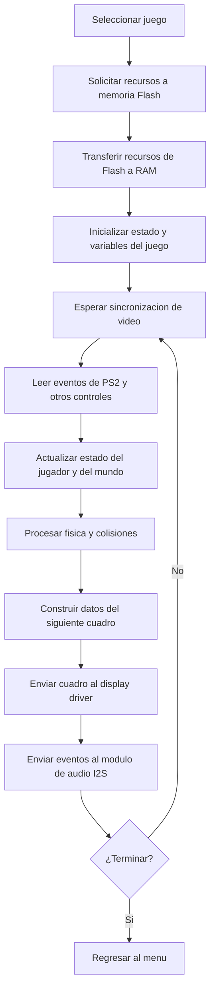
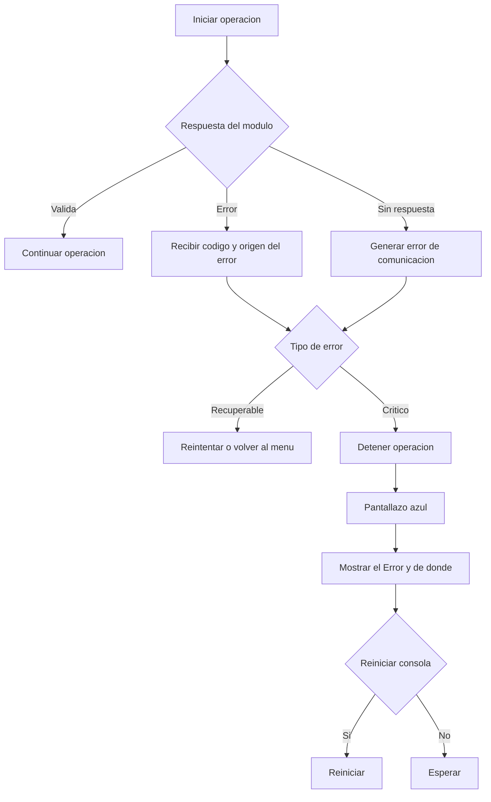

# QuadGB

## Diagrama de Flujo Principal

El sistema se divide en tres estados principales: Verificación, Menu principal y Juego.

## Diagrama de flujo de la consola

Este flujo representa la secuencia completa del sistema desde el encendido. Las
pruebas del POST pueden ejecutarse en paralelo, pero el sistema central espera
la respuesta de todos los módulos antes de habilitar el menú.

## Verificaciones de los sistemas al encender

Al encender el sistema, se ejecuta un diagnostico al hardware mientras se carga la secuencia una intro tipo ps3.

[Ejemplo intro](https://www.youtube.com/watch?v=Ywh-aIfEcew)

La idea es que mientras se este ejecutando esta intro, se ejecuten test de todos los modulos:

- Diagnóstico de Memoria: Verificación rápida de lectura/escritura en BRAM 

- Test de Periféricos: Detección de entradas conectadas mediante los controladores PS/2

- Test de salidas de video/audio.

cada test lo hace el grupo correspondiente y en el software al iniciarse simplemente se llaman.

## Menu Principal

### Menu
Interfaz de usuario en estado de espera para seleccionar juegos o ajustar parámetros de la consola.

    

## Juego (Game Loop)

- Carga de datos: Cargar los recursos necesarios desde la memoria.
- Logica principal: Procesar el estado del juego, físicas y colisiones.
- Entrada: Leer las acciones del jugador.
- Video: Actualizar los elementos graficos.
- Audio: Reproducir los sonidos del juego.

## Manejo de errores

Cada modulo debe informar si una operación termino correctamente o si ocurrio un error. En caso de fallo, se identifica el módulo, el código y la operación afectada.

Los errores pueden ser recuperables o críticos. Los recuperables permiten reintentar o volver al menú, los errores críticos detienen la operación y muestran una pantalla azul con la información del error. Si un módulo no responde a tiempo, se considera un error de comunicacion.

